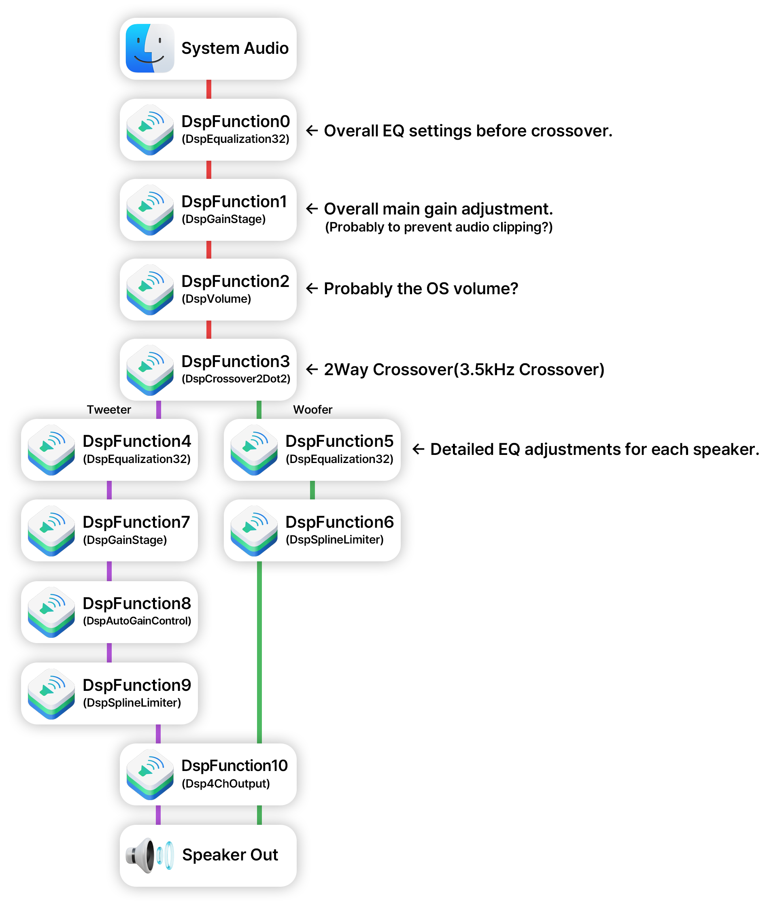

## Available effects
- Delay
- GainStage
- ClientGainAdjust
- Equalization
- Equalization32
- FIREqualization
- MultibandDRC
- DynamicRange
- StereoEnhancer
- BassEnhancer
- DCBlocker
- Crossover2Way
- Crossover2Dot1
- Crossover2Dot2
- NoiseCanceller
- BeamFormer
- 2ChInput
- 3ChOutput
- 4ChOutput
- 6ChOutput
- 2To4Splitter
- CalibrationEQ
- Volume
- Volume_4ch
- Volume_3ch
- Limiter
- MultiBandCompressor
- Loudness
- StereoToMono
- Virtualization
- AudioMeter
- 2To6Splitter
- PreGainStage
- AutoGainControl
- SplineLimiter
- Sum
- SplitBand
- Beam2
- MozartCompressor
- MozartCompressorDualBand
- BuzzKill
- ControlFreak2ch
- ControlFreak4ch
- XTC_2chIn_2chOut
- XTC_2chIn_4chOut
- ThermalSpeakerProtection2ch
- ThermalSpeakerProtection4ch
- FIRdirect_2chIn_2chOut
- FIRdirect_2chIn_4chOut

## Equalization32 info
* 2 - ChSelect
    * 0 - Left Channel
    * 1 - Right Channel
    * 2 - Both L+R Channels
            
* 3 - BandIndex
    * Increases with more filters and dependent on ChSelect Parameter

* 4 - BypassBand
    * Enables/Disables Filters

* 5 - FilterType
    * 1 - High Pass(LP)
    * 2 - Low Pass(HP)
    * 3 - Bandstop
    * 4 - Bandpass(PK)
    * 5 - Low Shelf(LS)
    * 6 - High Shelf(HS)

* 6 - Frequency
    * HZ, HZ translated from float->32uint
* 7 - Q
    * Dimensionless Unit Translated from float->32uint.
* 8 - Gain
    * DB translated from float->32uint

### Example
									<dict>
										<key>2</key>
										<integer>0</integer>
										<key>3</key>
										<integer>14</integer>
										<key>4</key>
										<integer>0</integer>
										<key>5</key>
										<integer>4</integer>
										<key>6</key>
										<integer>1161691136</integer>
										<key>7</key>
										<integer>1097859072</integer>
										<key>8</key>
										<integer>-1064304640</integer>
									</dict>
= Left Channel, 14 Band Index, No Bypass Band, Bandpass(PK), Frequency 3040Hz(Float32), Q 15(Float32), Gain -4.5dB(Float32)

									<dict>
										<key>2</key>
										<integer>2</integer>
										<key>3</key>
										<integer>0</integer>
										<key>4</key>
										<integer>0</integer>
										<key>5</key>
										<integer>1</integer>
										<key>6</key>
										<integer>1114636288</integer>
										<key>7</key>
										<integer>1060439283</integer>
										<key>8</key>
										<integer>-1069504319</integer>
									</dict>
= L+R Channel, 0 Band Index, No Bypass Band, High Pass(LP), Frequency 60Hz(Float32), Q 0.707107(Float32), Gain -3.0103dB(Float32)

## PatchbayInfo info
* InputPort
	* First input port of the current block
* PortInstance
	* The ID of this port
* PortWidth
	* Number of channels
* SourceFuncInstance
	* Signal source
* SourcePortIndex
	* Select which port to receive the signal from at the signal source

### Example
								<key>InputPort0</key>
								<dict>
									<key>PortInstance</key>
									<integer>0</integer>
									<key>PortWidth</key>
									<integer>1</integer>
									<key>SourceFuncInstance</key>
									<integer>1</integer>
									<key>SourcePortIndex</key>
									<integer>0</integer>
								</dict>
= 0 Input Port, Mono(Maybe?), In DspFunction1, In DspFunction1 Port 0

## DSP plugin layout diagram (iMac12,2)

## Sources
[Fortitude](https://www.insanelymac.com/forum/topic/350193-cannot-find-any-information-on-applehdas-eq-parameters/)
